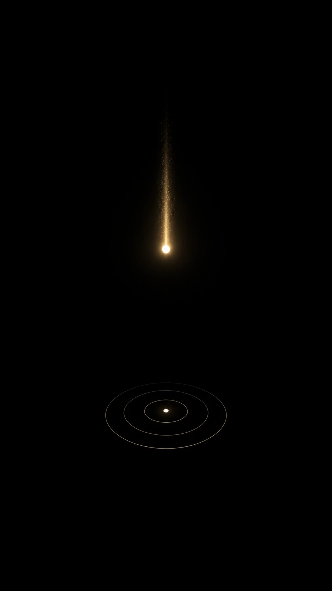
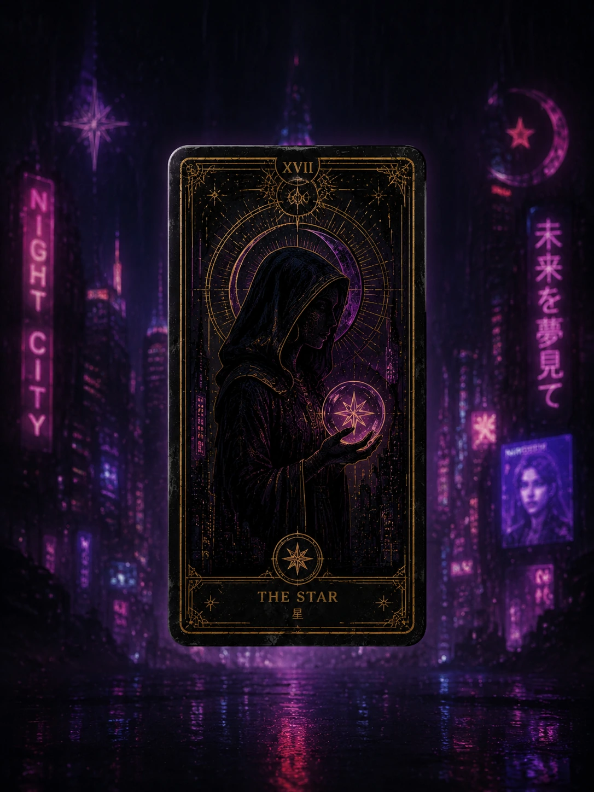
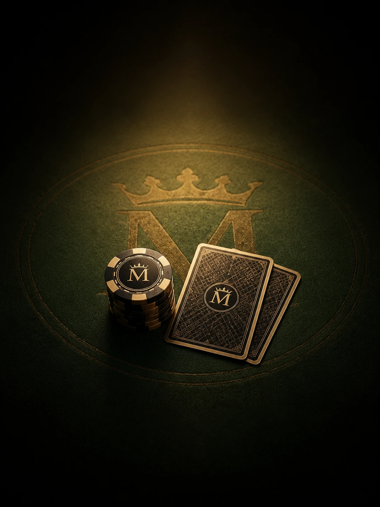
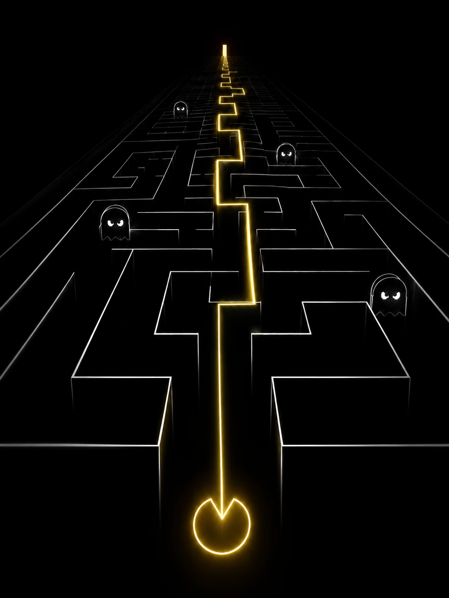
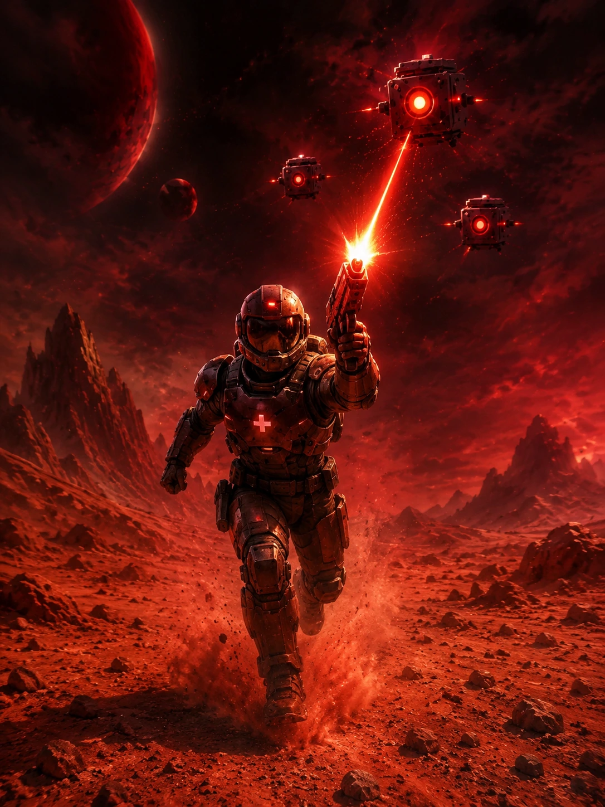
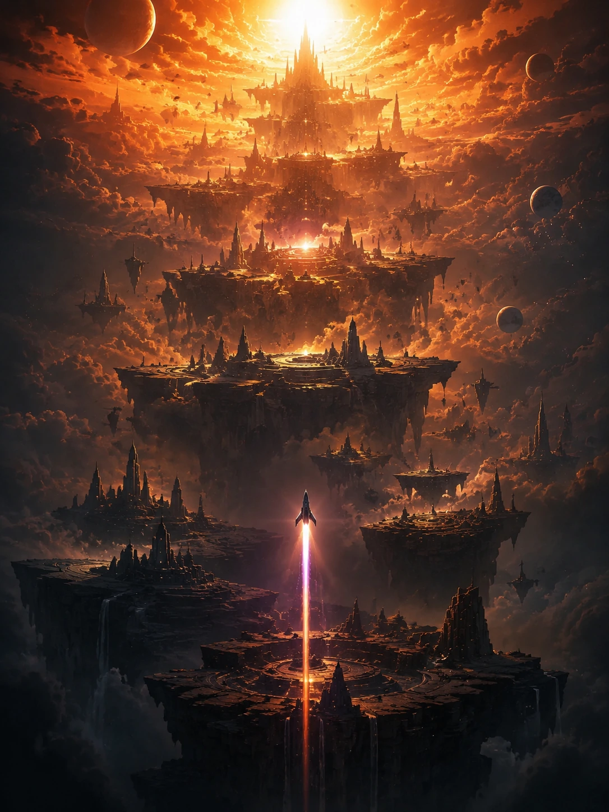
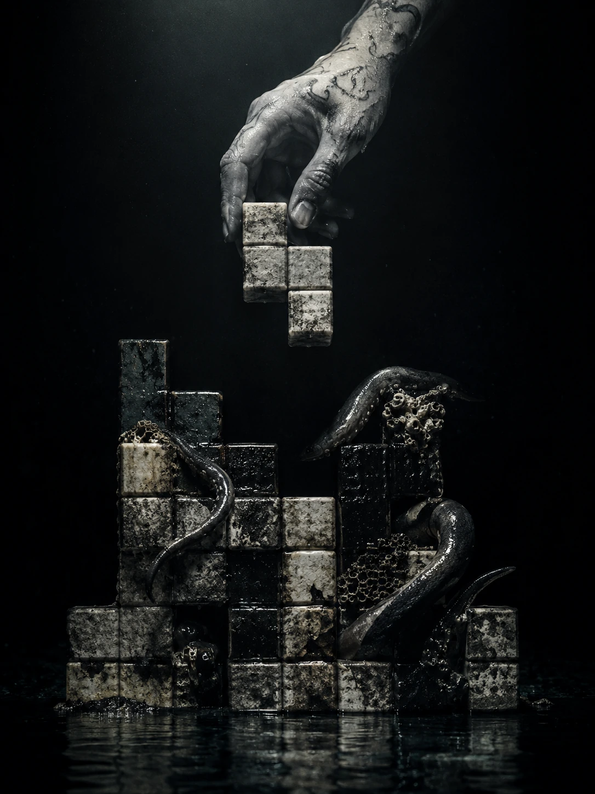
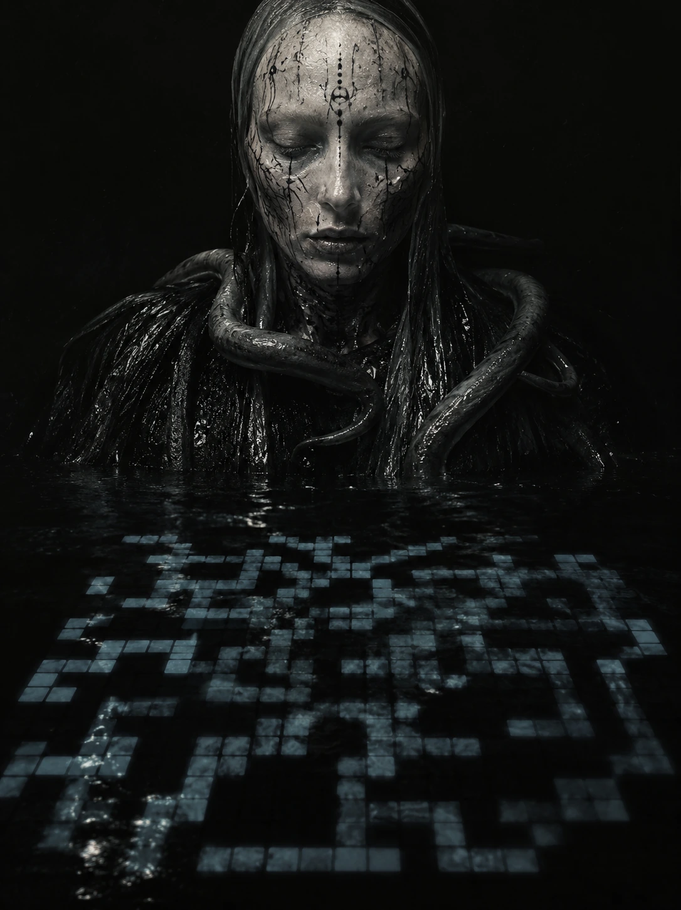
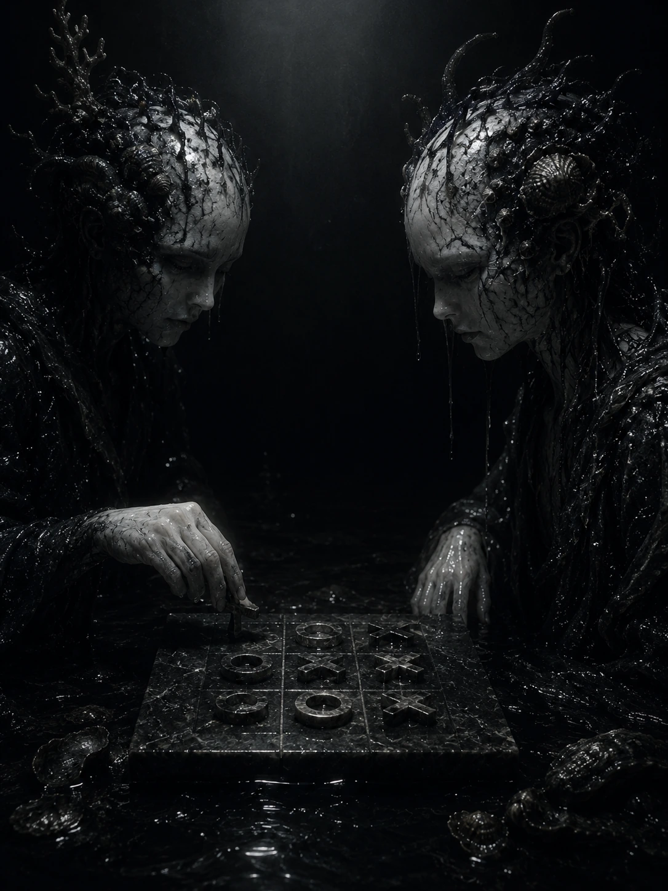

  

 

A React and TypeScript rebuild of the Obsidian game catalog, deployed as a
static single page app to GitHub Pages.

 

## Architecture

 

## Catalog

Eleven titles across seven genre shelves, each entry a discrete repository
composed into a single storefront by `src/data/games.ts`.

 

<table>
<tr>
<td width="220"></td>
<td>

### Obelisk Drift
*Every stone remembers its fall.*

A gravity physics ritual across a submerged ruin. Draw the fragment back, release it into the dark, and let each chamber's wells and currents carry it to the socket that calls it home. Ten chambers, real momentum, no two wells pull the same way twice.

**Genre:** Arcade &nbsp;·&nbsp; **Developer:** Obsidian Originals &nbsp;·&nbsp; **Editors' Choice**

</td>
</tr>
<tr>
<td width="220"></td>
<td>

### ARCANA: Night City Tarot
*Read the cards of Night City.*

A cyberpunk tarot experience covering all 22 Major Arcana cards, reimagined for a rain drenched neon city. Draw a single card, browse the full deck, or pull a three card past, present, future spread.

**Genre:** Mystical &nbsp;·&nbsp; **Developer:** Night City Dev &nbsp;·&nbsp; **Editors' Choice**

</td>
</tr>
<tr>
<td width="220"></td>
<td>

### CheckMate
*History's greatest moves. Solved by you.*

A curated chess puzzle collection built from decisive tactics played by Morphy, Fischer, Tal and Kasparov. A context aware hint system scales from beginner to grandmaster.

**Genre:** Puzzle & Strategy &nbsp;·&nbsp; **Developer:** CheckMate Labs &nbsp;·&nbsp; **Editors' Choice**

</td>
</tr>
<tr>
<td width="220"></td>
<td>

### Monarch Room
*Private Texas Hold'em.*

A private Texas Hold'em room with the elegance of a members only club. Face adaptive opponents and track VPIP, showdown rate and full hand history.

**Genre:** Card &nbsp;·&nbsp; **Developer:** Monarch Studios &nbsp;·&nbsp; **Editors' Choice**

</td>
</tr>
<tr>
<td width="220"></td>
<td>

### Aurum Maze
*Ten levels. One golden line.*

A minimal arcade chase built from black space, architectural white linework and pure gold. Guide a runner through ten handcrafted mazes while four rivals hunt the same paths.

**Genre:** Arcade &nbsp;·&nbsp; **Developer:** Obsidian Originals &nbsp;·&nbsp; **Editors' Choice**

</td>
</tr>
<tr>
<td width="220"></td>
<td>

### CosmoDrome
*An endless drift through the dark.*

A nostalgic endless space racer set deep in the drift of an alien cosmos. Steer through asteroid fields and face sector bosses with a combo multiplier on the line.

**Genre:** Racing &nbsp;·&nbsp; **Developer:** CosmoDrome Studios

</td>
</tr>
<tr>
<td width="220"></td>
<td>

### VoidRunner
*Sprint. Shoot. Survive.*

A high speed combat runner across the red sands of the Martian frontier. Jump, slide and fire an infinite energy laser as difficulty scales with every second.

**Genre:** Action &nbsp;·&nbsp; **Developer:** Driftline Games

</td>
</tr>
<tr>
<td width="220"></td>
<td>

### Skyfold Aviary
*Rise through the floating layers.*

A serene aerial run through layered floating terraces. Manage beam energy while navigating procedurally generated obstacle patterns across endless vertical layers.

**Genre:** Arcade &nbsp;·&nbsp; **Developer:** Driftline Games

</td>
</tr>
<tr>
<td width="220"></td>
<td>

### Reliquary
*Stack. Clear. Survive.*

A high energy take on the classic block stacking format. Stack falling pieces to clear lines and climb the leaderboard before the grid fills up.

**Genre:** Puzzle & Strategy &nbsp;·&nbsp; **Developer:** Vespers

</td>
</tr>
<tr>
<td width="220"></td>
<td>

### Abyssal Bloom
*Connect. Cascade. Score.*

A tactical grid based puzzle that rewards pattern recognition and forward thinking. Connect pathways on the neural network grid before the board locks up.

**Genre:** Puzzle & Strategy &nbsp;·&nbsp; **Developer:** Vespers

</td>
</tr>
<tr>
<td width="220"></td>
<td>

### Covenant
*Deceptively simple. Endlessly strategic.*

The two player classic with a smart AI opponent and a clean local multiplayer mode. Subtle animations reward every winning line.

**Genre:** Classic &nbsp;·&nbsp; **Developer:** Vespers

</td>
</tr>
</table>

 

## About this repository

This is a private portfolio project. It is not open to external
contributions, forks intended for submission, or collaboration requests.

 

Built with React, TypeScript, and Vite. No dependencies at runtime beyond the browser.

